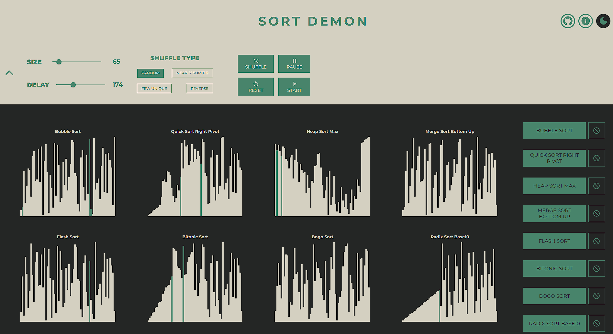
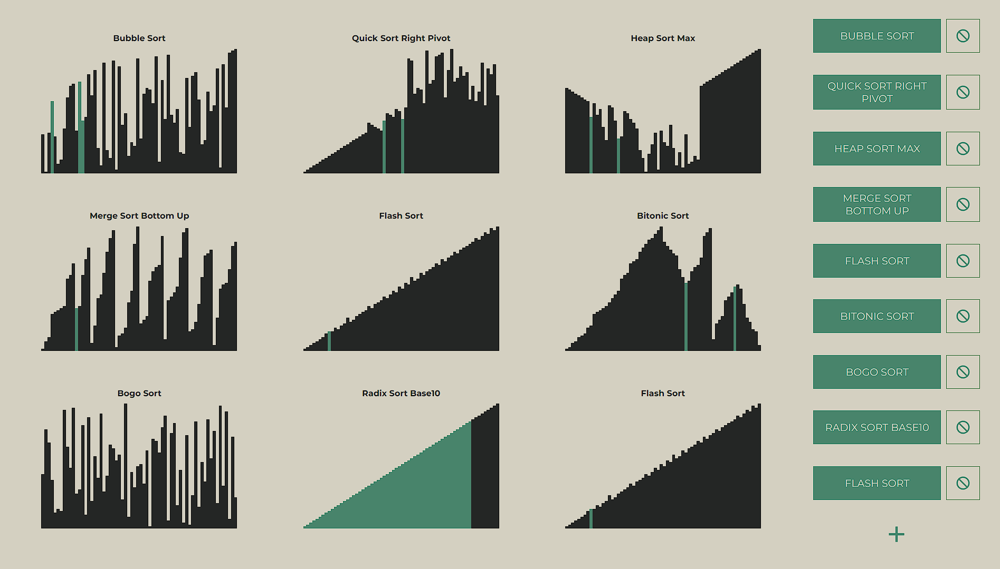

# Visualization of Sorting Algorithms

- Developed a comprehensive sorting algorithm visualizer website featuring over 30 unique algorithms, built using React, Redux, and Styled Components to facilitate learning and understanding of various sorting concepts.
- Integrated Material UI, Framer Motion, react-animate-height, and react-code-blocks to enhance user experience with interactive icons, sliders, responsive sidebars, modals, and collapsible list elements.
- Utilized Create React App for initial project template, allowing for rapid development and customization of the educational tool to provide custom delay times and input array sizes for an optimized learning experience.

## Demo



## Technologies

#### Main

-   **React**
-   **Redux** (with react-redux)
-   **Styled Components**

#### Other

-   **Material UI** (icons and slider component)
-   **Framer Motion** (animating responsive sidebars and modals)
-   **react-animate-height** (animating collapsable list elements)
-   **react-code-blocks** (code snippet component in descriptions)
-   **Create React App** (initial project template)

## Run Locally

Clone the project

```bash
  git clone https://github.com/KushajveerSingh/sort_visualizer
```

Go to the project directory

```bash
  cd sort_visualizer
```

Install dependencies

```bash
  npm install
```

Start the server

```bash
  npm start
```
